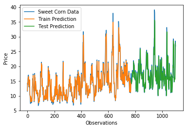
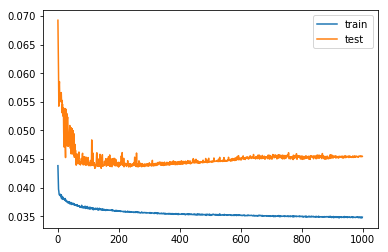

# Sweet Corn Terminal Price Forecasting with LSTMs in Keras
Weiling(Geoffrey) Zhu

## Abstract
This project implements a street sign Sweet Corn Terminal Price Forecasting using LSTMs in Keras. This project is written in Python 3. The `keras`, `tensorflow`, and `scikit-learn` packages were used to build the model. Data visualization and preprocessing was done with the `matplotlib` packages.

## Dataset

The following dataset were considered for this project:

- [USDA - Fruit and Vegetable - Terminal Market Price - Reports](https://marketnews.usda.gov/mnp/fv-report?commAbr=CORN&rowDisplayMax=25&startIndex=1&repType=termPriceWeekly&reportConfig=true&reportConfig=true&reportConfig=true&reportConfig=true&reportConfig=true&reportConfig=true&reportConfig=true&reportConfig=true&reportConfig=true&reportConfig=true&reportConfig=true&reportConfig=true&reportConfig=true&reportConfig=true&reportConfig=true&repTypeChanger=termPriceWeekly&type=termPrice&locChoose=commodity&locAbrfrom=HX&locAbrlength=1&locAbr=&commodityClass=allcommodity&y=15&y=15&y=11&y=11&y=13&y=15&y=14&y=8&y=0&y=9&y=9&y=11&y=7&y=8&y=12&x=32&x=28&x=27&x=52&x=36&x=40&x=40&x=24&x=34&x=50&x=28&x=52&x=25&x=23&x=43&locAbrPass=ALL%7C%7C&refine=false&step3date=true&repDate=01%2F07%2F2017&endDate=12%2F29%2F2018&organic=&environment=&_environment=1&Run=Run) - a USDA Datasource for Terminal Market Price of Fruit and Vegetable.
- Original download file: [terminal prices sweet corn.xlsx](https://github.com/Geoffrey-Z/Multivariate-Time-Series-Forecasting-with-LSTMs-in-Keras-for-CORN-SWEET-Terminal-Market-Price/blob/master/terminal%20prices%20sweet%20corn.xlsx)

The datasets below were selected due to its simplicity and smaller size. The USDA dataset is very large, and has far more data than is necessary for a small-scale project like this.
- CORN_SWEET_Price_Monthly_Univariate_Forecasting: [BI-COLOR CORN-SWEET MONTHLY PRICE 1998-2018.csv](https://github.com/Geoffrey-Z/Multivariate-Time-Series-Forecasting-with-LSTMs-in-Keras-for-CORN-SWEET-Terminal-Market-Price/blob/master/Dataset/BI-COLOR%20CORN-SWEET%20MONTHLY%20PRICE%201998-2018.csv)
- CORN_SWEET_Price_Weekly_Univariate_Forecasting: [BI-COLOR CORN-SWEET WEEKLY PRICE 1998-2018.csv](https://github.com/Geoffrey-Z/Multivariate-Time-Series-Forecasting-with-LSTMs-in-Keras-for-CORN-SWEET-Terminal-Market-Price/blob/master/Dataset/BI-COLOR%20CORN-SWEET%20WEEKLY%20PRICE%201998-2018.csv)
- CORN_SWEET_Price_Weekly_Multivariate_Forecasting: [BI-COLOR, WHITE, YELLOW CORN-SWEET WEEKLY PRICE 1998-2018.csv](https://github.com/Geoffrey-Z/Multivariate-Time-Series-Forecasting-with-LSTMs-in-Keras-for-CORN-SWEET-Terminal-Market-Price/blob/master/Dataset/BI-COLOR%2C%20WHITE%2C%20YELLOW%20CORN-SWEET%20WEEKLY%20PRICE%201998-2018.csv)

## Splitting

The CORN_SWEET_Price_Weekly_Multivariate_Forecasting dataset is splited into  into Training Set (first 70% rows) and Validation Set (remaining 30% rows).

## Input Data Visualization

The CORN_SWEET_Price_Weekly_Multivariate_Forecasting dataset contains 1099 records, 4 Columns. It contains weekly terminal prices for BI-COLOR, WHITE and YELLOW CORN-SWEET in U.S. from 1/1/1998 to 12/31/2018. The visualization below showing the 21 years of data for each Variety.


## Network Architecture

I used a LSTM to forecastin the price of sweet corn. I chose this type of model because they are known to perform quite well on time Series datasets, such as Airline Passengers prediction problem and Air Pollution Forecasting. The architecture of the final version of the Keras model is shown below.

```python
# design network
model = Sequential()
model.add(LSTM(50, input_shape=(train_X.shape[1], train_X.shape[2])))
model.add(Dense(1))
model.compile(loss='mae', optimizer='adam',metrics=['mse'])
# fit network
history = model.fit(train_X, train_y, epochs=125, batch_size=1, validation_data=(test_X, test_y), verbose=2, shuffle=False)
# plot history
pyplot.plot(history.history['loss'], label='train')
pyplot.plot(history.history['val_loss'], label='test')
pyplot.legend()
pyplot.show()
```

This architecture is a relatively simple LSTM network. It achieves an accuracy with an r-squared value of 0.82 on the test dataset. This was the simplest and most accurate model out of several variants I tried. Listed below are some of the variants I tried out.

- Increasing the number of epochs from 125 to 1000. This resulted by 8 times training time. However, the accuracy decreased by ~4.8%. The model stared overfiting at 123th epoch. 
- Increasing the number of batch_size from 1 to 72. This resulted in a faster training time. However, the accuracy decreased by ~2.3%.
- Increasing the number of neurons in the first hidden layer from 50 to 4. This resulted in a same training time. This did not affect accuracy.
- Adding another hidden layer after the first hidden layer. This did not affect accuracy.

## Results

When trained for 125 epochs with a batch size of 1, this network is able to obtain an accuracy with an r-squared value of 0.85 on the test dataset.
We can see that the model did an excellent job of fitting both the training and the test datasets.



## Benchmarks

There are many different Time Series Forecasting benchmarks in common use today. Generalizing across datasets, Multivariate-Time-Series-Forecasting-with-LSTMs and Univariate-Time-Series-Forecasting-with-LSTMs not make much diffrent of the accuracy (0.82 R2 vs. 0.85 R2), but training time increas.
- [How to Create an ARIMA Model for Time Series Forecasting in Python](https://machinelearningmastery.com/arima-for-time-series-forecasting-with-python/)
- [Time Series Prediction with LSTM Recurrent Neural Networks in Python with Keras](https://machinelearningmastery.com/time-series-prediction-lstm-recurrent-neural-networks-python-keras/)
- [Multivariate Time Series Forecasting with LSTMs in Keras](https://machinelearningmastery.com/multivariate-time-series-forecasting-lstms-keras/)

## Learning Curves

Shown below is a plot of the model's loss on the training and validation datasets per epoch during training.



## Training Time

The relationship between training time and number of epochs is linear.

The relationship between training time and dataset size is linear.

The relationship between training time and batch_size is negative linear.

The relationship between training time and number of variate is negative linear.

__Tatle training time_________Epochs_____Each epochs training time_____dataset size_____batch_size_____variate

          25s                    50                0s                     770               72           3
          
         500s                  1000                0s                     770               72           3
         
         500s                   125                4s                     770                1           3
         
        2000s                  1000                2s                     770                1           3
        
        1000s                  1000                1s                     770                1           1
        
        1000s                  1000                0s                      64                1           1

## Future study

Try temporal convolutional network (TCN) architecture.

For most deep learning practitioners, sequence modeling is synonymous with recurrent networks. Yet recent results indicate that convolutional architectures can outperform recurrent networks on tasks such as audio synthesis and machine translation. Given a new sequence modeling task or dataset, which architecture should one use? Shaojie Bai conduct a systematic evaluation of generic convolutional and recurrent architectures for sequence modeling. The models are evaluated across a broad range of standard tasks that are commonly used to benchmark recurrent networks. Their results indicate that a simple convolutional architecture outperforms canonical recurrent networks such as LSTMs across a diverse range of tasks and datasets, while demonstrating longer effective memory. They conclude that the common association between sequence modeling and recurrent networks should be reconsidered, and convolutional networks should be regarded as a natural starting point for sequence modeling tasks.
- [An Empirical Evaluation of Generic Convolutional and Recurrent Networks
for Sequence Modeling](https://arxiv.org/pdf/1803.01271.pdf)


