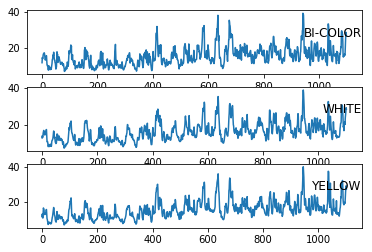

# Sweet Corn Terminal Price Forecasting with LSTMs in Keras
Weiling(Geoffrey) Zhu

## Abstract
This project implements a street sign Sweet Corn Terminal Price Forecasting using LSTMs in Keras. This project is written in Python 3. The `keras`, `tensorflow`, and `scikit-learn` packages were used to build the model. Data visualization and preprocessing was done with the `matplotlib` packages.

## Dataset

The following dataset were considered for this project:

- [USDA - Fruit and Vegetable - Terminal Market Price - Reports](https://marketnews.usda.gov/mnp/fv-report?commAbr=CORN&rowDisplayMax=25&startIndex=1&repType=termPriceWeekly&reportConfig=true&reportConfig=true&reportConfig=true&reportConfig=true&reportConfig=true&reportConfig=true&reportConfig=true&reportConfig=true&reportConfig=true&reportConfig=true&reportConfig=true&reportConfig=true&reportConfig=true&reportConfig=true&reportConfig=true&repTypeChanger=termPriceWeekly&type=termPrice&locChoose=commodity&locAbrfrom=HX&locAbrlength=1&locAbr=&commodityClass=allcommodity&y=15&y=15&y=11&y=11&y=13&y=15&y=14&y=8&y=0&y=9&y=9&y=11&y=7&y=8&y=12&x=32&x=28&x=27&x=52&x=36&x=40&x=40&x=24&x=34&x=50&x=28&x=52&x=25&x=23&x=43&locAbrPass=ALL%7C%7C&refine=false&step3date=true&repDate=01%2F07%2F2017&endDate=12%2F29%2F2018&organic=&environment=&_environment=1&Run=Run) - a USDA Datasource for Terminal Market Price of Fruit and Vegetable.
- Original download file: [terminal prices sweet corn.xlsx](https://github.com/Geoffrey-Z/Multivariate-Time-Series-Forecasting-with-LSTMs-in-Keras-for-CORN-SWEET-Terminal-Market-Price/blob/master/terminal%20prices%20sweet%20corn.xlsx)

The datasets below were selected due to its simplicity and smaller size. The USDA dataset is very large, and has far more data than is necessary for a small-scale project like this.
- CORN_SWEET_Price_Monthly_Univariate_Forecasting: [BI-COLOR CORN-SWEET MONTHLY PRICE 1998-2018.csv](https://github.com/Geoffrey-Z/Multivariate-Time-Series-Forecasting-with-LSTMs-in-Keras-for-CORN-SWEET-Terminal-Market-Price/blob/master/BI-COLOR%20CORN-SWEET%20MONTHLY%20PRICE%201998-2018.csv)
- CORN_SWEET_Price_Weekly_Univariate_Forecasting: [BI-COLOR CORN-SWEET WEEKLY PRICE 1998-2018.csv](https://github.com/Geoffrey-Z/Multivariate-Time-Series-Forecasting-with-LSTMs-in-Keras-for-CORN-SWEET-Terminal-Market-Price/blob/master/BI-COLOR%20CORN-SWEET%20WEEKLY%20PRICE%201998-2018.csv)
- CORN_SWEET_Price_Weekly_Multivariate_Forecasting: [BI-COLOR, WHITE, YELLOW CORN-SWEET WEEKLY PRICE 1998-2018.csv](https://github.com/Geoffrey-Z/Multivariate-Time-Series-Forecasting-with-LSTMs-in-Keras-for-CORN-SWEET-Terminal-Market-Price/blob/master/BI-COLOR%2C%20WHITE%2C%20YELLOW%20CORN-SWEET%20WEEKLY%20PRICE%201998-2018.csv)

## Splitting

The CORN_SWEET_Price_Weekly_Multivariate_Forecasting dataset is splited into  into Training Set (first 70% rows) and Validation Set (remaining 30% rows).

## Input Data Visualization

